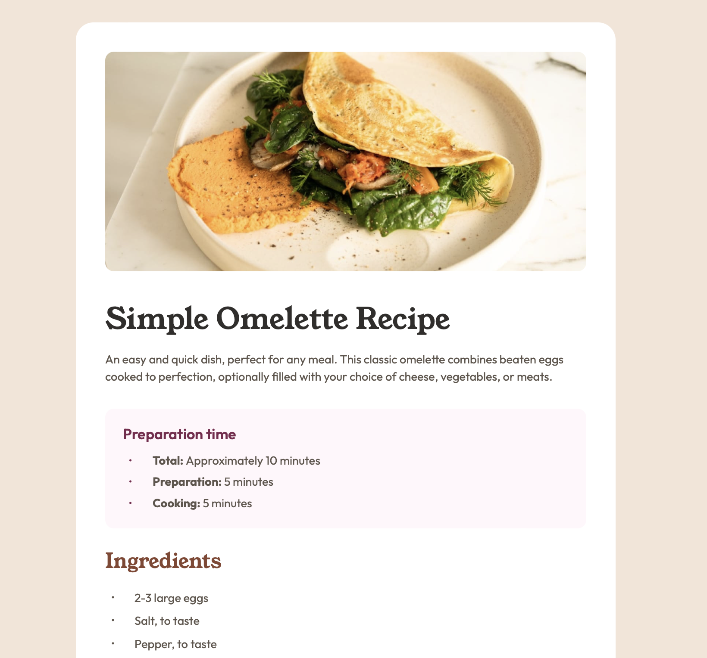
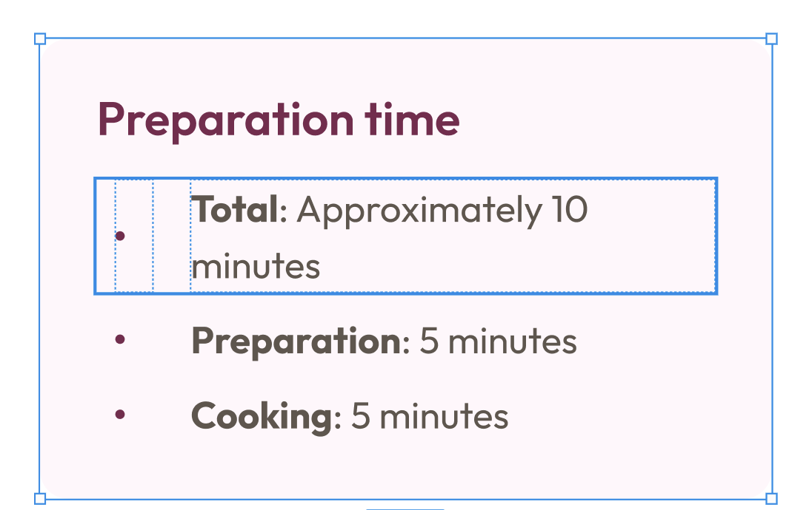

# Frontend Mentor - Recipe page solution

This is a solution to the [Recipe page challenge on Frontend Mentor](https://www.frontendmentor.io/challenges/recipe-page-KiTsR8QQKm). Frontend Mentor challenges help you improve your coding skills by building realistic projects. 

## Table of contents

- [Overview](#overview)
  - [The challenge](#the-challenge)
  - [Screenshot](#screenshot)
  - [Links](#links)
- [My process](#my-process)
  - [Built with](#built-with)
  - [What I learned](#what-i-learned)
  - [Continued development](#continued-development)
  - [Useful resources](#useful-resources)
- [Author](#author)
- [Acknowledgments](#acknowledgments)

**Note: Delete this note and update the table of contents based on what sections you keep.**

## Overview

### Screenshot

### Links

- [Solution URL](https://github.com/edpau/fm_recipe-page)
- [Live Site URL](https://edpau.github.io/fm_recipe-page/)

## My process

### Built with

- Semantic HTML5 markup
- Mobile-first workflow
- CSS Flexbox
- CSS BEM

### What I learned

I learned how to style the list marker and finely control the gap after the List Marker using:
 - list-style-position: inside
 - list-style-type: "✓";
 - ::marker pseudo-element
 - ::before pseudo-element
 - content: counter(list-item)".";

I matched the Figma design below, I adjusted the gap after the list Marker and its size and I centered the list marker against the line break, positioning it midway between the line 'Total: Approximately 10' and minutes. 

But I sacrifice the accessibility for screen reader on the list. 

### Continued development

- Improve the accessibility for screen reader on the list while keeping the Figma design on teh list marker.

### Useful resources

- [How To Style a Table with CSS](https://www.digitalocean.com/community/tutorials/how-to-style-a-table-with-css) - Useful guid on styling a Table with CSS.
- [Everything You Need to Know About the Gap After the List Marker](https://css-tricks.com/everything-you-need-to-know-about-the-gap-after-the-list-marker/) - This is an amazing article discussing how to control the gap after the list-marker.

## Author
- Website - [Edward Pau](https://www.edpau.me)
- Frontend Mentor - [@edpau](https://www.frontendmentor.io/profile/edpau)

## Acknowledgments
Thank you, Grace Snow, for reviewing my code and helping me improve it.